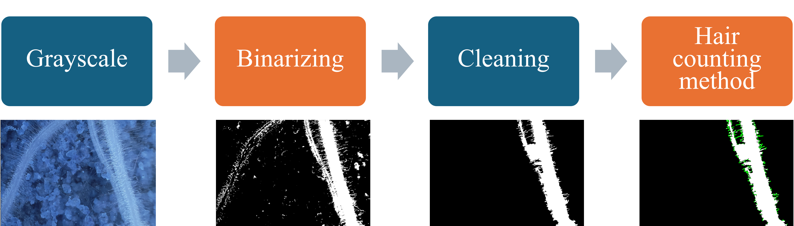

# Root Hair Counting and Image Super-Resolution


This repository contains the code and resources for the paper:
**[A Novel Approach for Plant Root-Hair Counting and Its Improvement via Image Super-Resolution](https://ieeexplore.ieee.org/document/11030939)**.


## Overview

This project presents a novel image analysis pipeline for accurately counting plant root hairs. The core of the pipeline is implemented in the `root_hair_counting.py` script. The paper explores the effectiveness of this approach and demonstrates its improvement when combined with image super-resolution techniques.

This repository also includes supporting scripts for various image processing tasks used in the research. The `main.py` script provides a structured way to execute the different stages of the analysis.



## Repository Contents

* `root_hair_counting.py`: **The main script** implementing the root hair counting algorithm.
* `adaptive_thresholding.py`: Script for performing adaptive thresholding on images.
* `canny_edge detection.py`: Script for detecting edges in images using the Canny algorithm.
* `get_HSL_from_image.py`: Script to extract HSL (Hue, Saturation, Lightness) color information from images.
* `th_algorithm_selection.py`: Script for evaluating different thresholding techniques.

### Prerequisites

* Python 3.x
* Required Python packages (see `requirements.txt`). You can install them using pip:

```bash
pip install -r requirements.txt
```

*(You'll need to create this file listing dependencies like OpenCV, NumPy, etc.)*


## Usage

The `root_hair_counting.py` script provides a central point for running the root counting algorithm.
